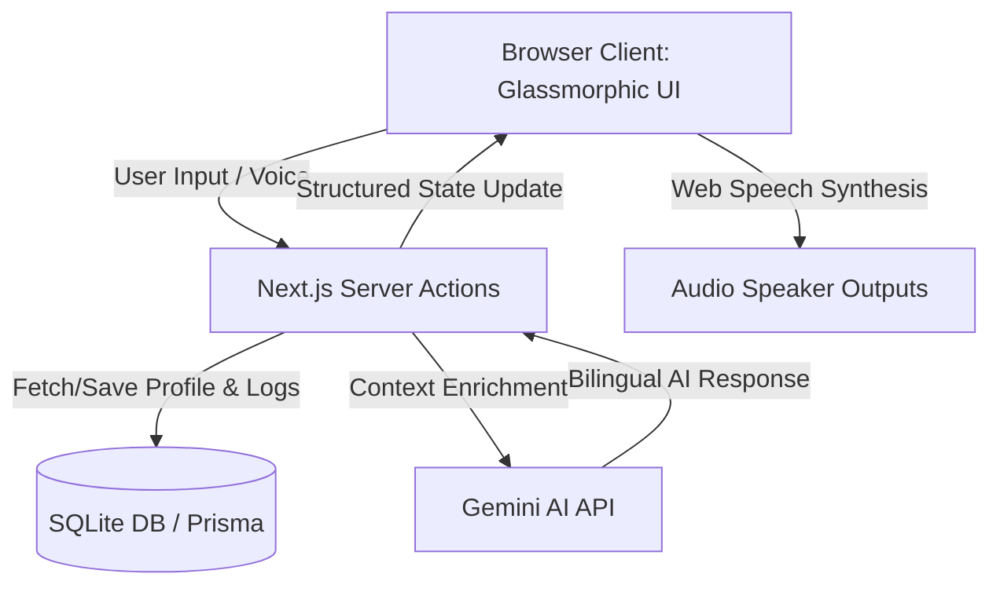

# Krishi Sakhi (ಕೃಷಿ ಸಖಿ) - AI Farming Assistant

Krishi Sakhi is a state-of-the-art, high-fidelity bilingual (English/Kannada) web application designed specifically for farmers in Karnataka. Leveraging secure, server-side Gemini AI models, browser-native Web Speech APIs, and a glassmorphic dashboard, Krishi Sakhi serves as an intelligent companion for personalized daily advisories, voice-based crop consultations, and activity logging.

---

## 🌟 Key Features

### 1. Bilingual Native Interface (English & ಕನ್ನಡ)
- Complete UI translation support with immediate language toggling.
- Full localization of agricultural terms tailored to Karnataka’s regional vocabulary.

### 2. Farmer & Farm Profiling
- Detailed profiles capturing the farmer's Name, District (mapped to agro-climatic zones), Soil Type, Crops Cultivated (e.g., Ragi, Coconut, Arecanut), Land Size, and Irrigation Status.
- Multi-profile support managed dynamically through a persistent local SQLite database.

### 3. Voice-to-Voice AI Assistant
- Integrated Speech-to-Text (transcription) and Text-to-Speech (synthesis) using native browser Web Speech APIs.
- Interactive, multi-turn bilingual chat interface powered by `gemini-1.5-flash`.
- Deep context enrichment: The AI understands the active farmer's profile, chosen crops, district weather, and local agricultural practices before responding.

### 4. Smart Farm Activity Timeline
- Chronological logging of all agricultural activities (e.g., Planting, Irrigation, Fertilization, Pest Control, Harvesting).
- Categorized database records showing exactly what occurred and when.

### 5. Automated AI Agricultural Advisories
- Proactive suggestions based on dynamic soil-crop combinations.
- Real-time weather impact evaluations (e.g., if heavy rain is simulated, the system flags alerts instructing farmers to hold off on spraying pesticides).

### 6. Localized Market & Policy Widgets
- **Live Karnataka APMC Price Ticker**: Smoothly scrolling display showcasing current trading prices for key crops like Ragi, Jowar, Coconut, and Arecanut.
- **Government Schemes Directory**: A curated list of specific Karnataka state benefits (such as Krishi Bhagya, Surya Raitha, and PM-Kisan) with clear eligibility criteria.

---

## 🛠️ Technology Stack

- **Frontend Framework**: Next.js 15 (React 19) utilizing App Router.
- **Styling**: Tailwind CSS v4 for absolute layout flexibility, custom dark mode variables, glassmorphic styling, and animation tickers.
- **Database ORM**: Prisma ORM with SQLite database (zero-setup local storage).
- **Core AI Integration**: Google Gemini API via server-side `@google/genai` SDK.
- **Bilingual Speech**: Browser Web Speech API (`SpeechRecognition` & `SpeechSynthesis`).
- **Development Language**: TypeScript & strict ESLint for compile-time safety.

---

## 💾 Database Architecture

The application uses SQLite as a localized, persistent database. The schema includes two main models with cascading deletes:

```prisma
model FarmerProfile {
  id               String            @id @default(uuid())
  name             String
  district         String
  soilType         String
  crops            String            // Stored as comma-separated values or JSON
  landSize         Float
  isIrrigated      Boolean
  createdAt        DateTime          @default(now())
  updatedAt        DateTime          @updatedAt
  activityLogs     FarmActivityLog[]
}

model FarmActivityLog {
  id               String            @id @default(uuid())
  farmerProfileId  String
  farmerProfile    FarmerProfile     @relation(fields: [farmerProfileId], references: [id], onDelete: Cascade)
  activityType     String            // PLANTING, IRRIGATION, FERTILIZATION, PEST_CONTROL, HARVESTING, OTHER
  description      String
  loggedAt         DateTime          @default(now())
}
```

---

## 📐 Clean Architecture & Data Flow



1. **Client Interface**: Captures actions, coordinates simulated weather settings, toggles translations, and records audio.
2. **Server Actions (`src/server/actions.ts`)**: Decouples API endpoints, ensuring environment variables (`GEMINI_API_KEY`) remain secure on the server side and never leak to the client.
3. **Gemini Service (`src/server/gemini.ts`)**: Applies custom instructions regarding Karnataka's districts (e.g., Mandya, Shimoga), soil patterns, and local crops, validating requests before dispatching them to `gemini-1.5-flash`.
4. **Local Database**: Instantly stores profile parameters and logs, guaranteeing complete offline privacy for farmers.

---

## 🚀 Setting Up the Project

### Prerequisites
- Node.js (v18.x or later)
- npm or yarn

### 1. Install Dependencies
```bash
npm install
```

### 2. Configure Environment Variables
Create a file named `.env` in the root directory and add:
```env
DATABASE_URL="file:./db.sqlite"
GEMINI_API_KEY="YOUR_ACTUAL_GEMINI_API_KEY"
```

### 3. Initialize the Database
Boot and synchronize the local SQLite database instantly:
```bash
npx prisma db push
```

### 4. Launch the Development Server
```bash
npm run dev
```
Open [http://localhost:3000](http://localhost:3000) in your web browser.
